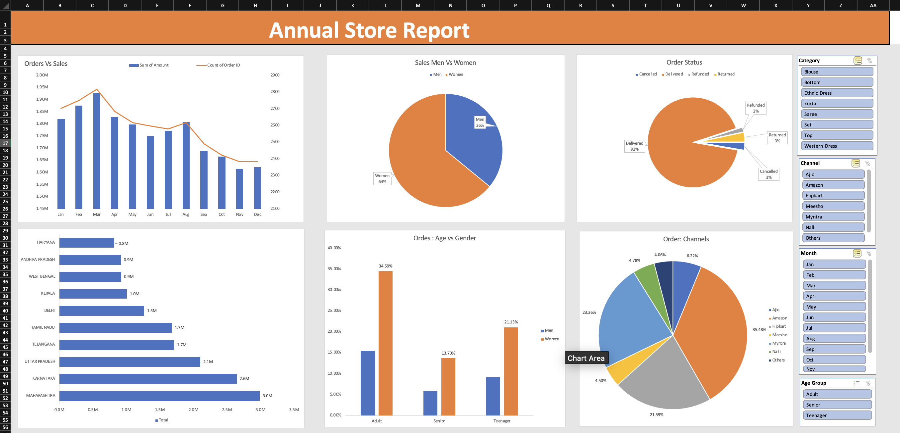

# Annual Store Report Dashboard
---

---

## Overview
This dashboard provides an annual overview of store performance, highlighting key metrics such as total orders, sales trends, customer demographics, and sales channels. The goal is to give a clear, interactive snapshot of business performance and help stakeholders make data-driven decisions.

## Features
1. **Orders vs. Sales Chart (Top-Left)**
   - A bar and line combination chart showing total orders (bars) versus total sales (line) over a specific time period or product categories.
   - Helps visualize trends in orders placed and revenue generated.

2. **Sales by Gender (Top-Center)**
   - A pie chart illustrating the proportion of sales made by men vs. women.
   - Quickly identifies which gender segment contributes most to sales.

3. **Order Status (Top-Right)**
   - A pie chart displaying the breakdown of orders by status (e.g., completed, pending, returned).
   - Provides insight into the overall health of the order fulfillment process.

4. **Orders by Age Group (Bottom-Center)**
   - A bar chart categorizing orders based on customer age ranges (e.g., teenagers, adults, seniors).
   - Useful for targeting marketing efforts and understanding which age groups are most active.

5. **Order Channels (Bottom-Right)**
   - A pie chart showing the distribution of orders across different sales channels (e.g., online, in-store, phone).
   - Highlights the most popular channels and where to allocate resources.

6. **Slicers (Right-Side)**
   - Interactive filters that allow you to slice data by **Category**, **Region**, **Manager**, or other fields.
   - Selecting or deselecting items in the slicers will update all charts simultaneously, enabling quick, customized views of the data.

## How to Use
1. **Open the Excel File**  
   Make sure macros are enabled if your file uses them, and that your data is in an Excel Table or connected via Power Query.

2. **Refresh Data (If Needed)**  
   - Go to **Data > Refresh All** to pull the latest data if you’re connected to external data sources.
   - Ensure the pivot tables and charts are linked to the correct data range.

3. **Apply Filters via Slicers**  
   - Click on any slicer to filter the dashboard.  
   - Multiple selections are possible by holding **Ctrl** (Windows) or **Cmd** (Mac) while clicking.

4. **Analyze the Charts**  
   - Hover over each segment of the pie/bar charts to see exact figures or percentages.
   - Identify trends and outliers in your orders, sales, and demographic breakdowns.

5. **Reset Filters**  
   - Clear slicer selections to return to the default (overall) view of the data.

## Data Sources
- **Sales Transactions:** Contains order details (date, amount, status, channel).
- **Customer Demographics:** Includes gender, age group, and location.
- **Product Categories (Optional):** Allows further breakdown of sales by product lines.

## Customization
- **Change Time Period:** You can modify date filters or the pivot table fields to show monthly, quarterly, or yearly data.
- **Add/Remove Charts:** Insert new pivot tables/charts or remove ones that are not relevant to your analysis.
- **Adjust Color & Style:** Update chart colors, fonts, and layout to match your branding or presentation style.

## Notes
- The dashboard is fully dynamic; any new data added to the underlying table(s) will be reflected once you **Refresh All**.
- The design is optimized for a standard 16:9 screen size. Adjust row/column sizes if you need to fit different screen resolutions.
- Always check for data integrity and consistency before finalizing the dashboard for decision-making.

---